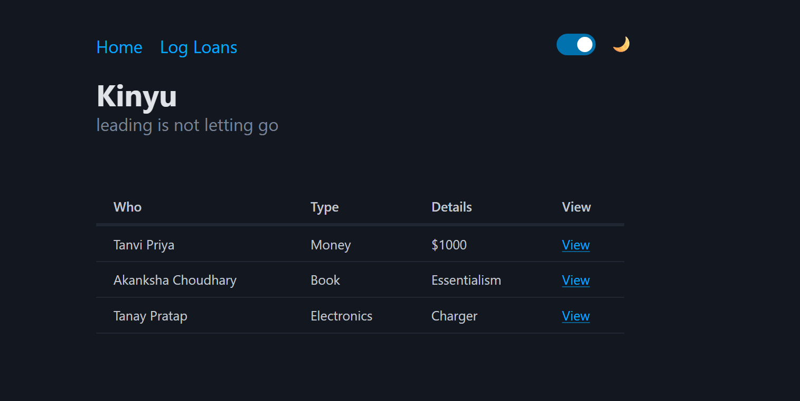
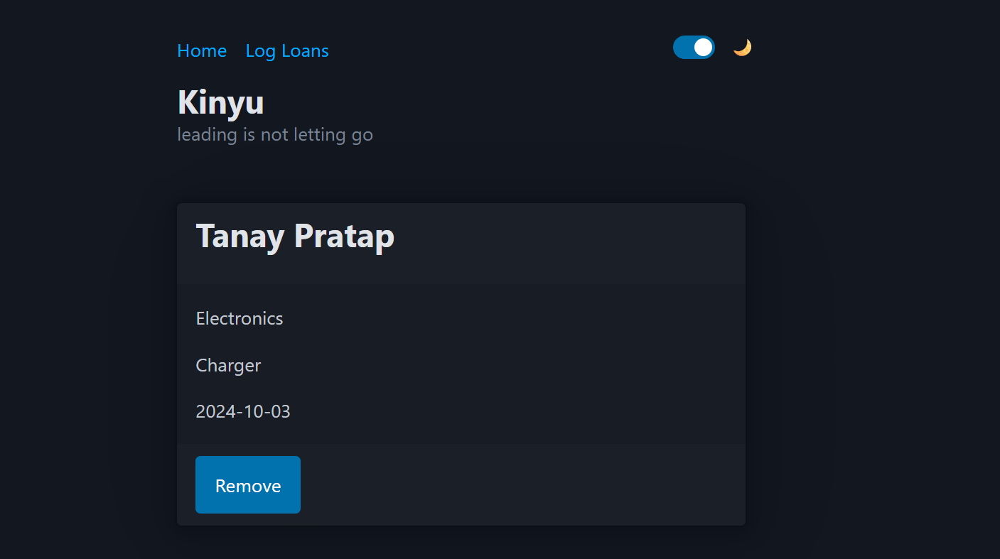
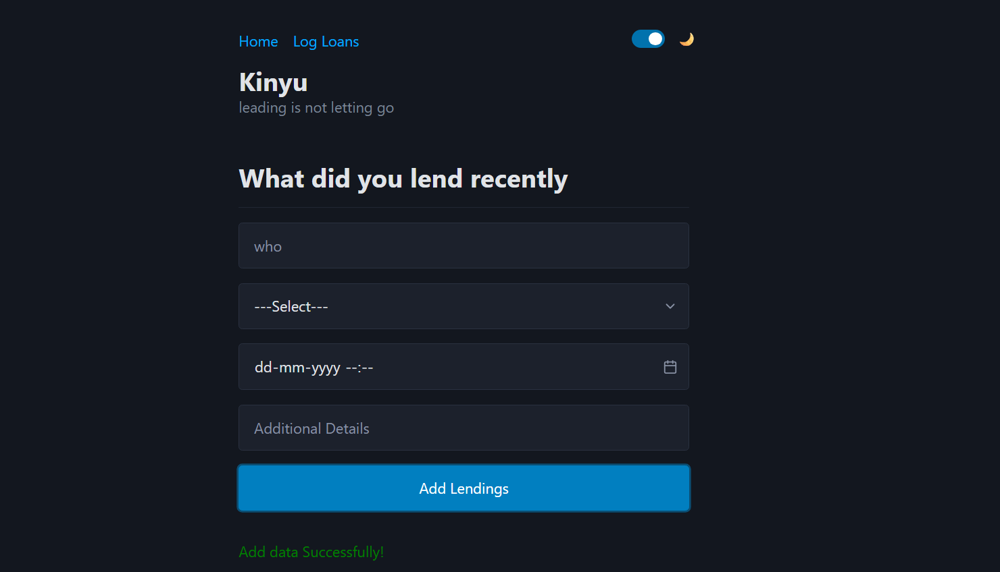

# 📦 Kinyu App (Atom Router)

---

## 🔍 Purpose

This app is built to:

- Manage lending details using CRUD operations (Create, Read, Update, Delete) through API calls.

- Add new lending data via a form and store it in the backend API.

- View the list of all lendings and navigate to individual details pages using Atom Router.

- Remove existing lending entries directly from the

---

## 🚀 Tech Stack

- HTML CSS
- Atom Router
- Basic CSS or Pico.css (optional)

---


## [GO LIVE](https://f7p6nv.csb.app/)


---

---



## 🛠️ Installation

```bash
git clone https://github.com/Sourabhpande532/kinyu-api-dashboard.git
cd kinyu-api-dashboard
npm install
npm run dev
```
 
 ***
 ## Technologies used

> HTML

> PICO CSS  

> Atom Router
---

***

## **Skill Gained in the project**
   - Solid understanding of custom routes and dynamic parameters.
   - Learned how frontend routing interacts with API data.
   - Gained experience in updating and deleting data via API calls.
   - Better understanding of UI state changes based on API responses..